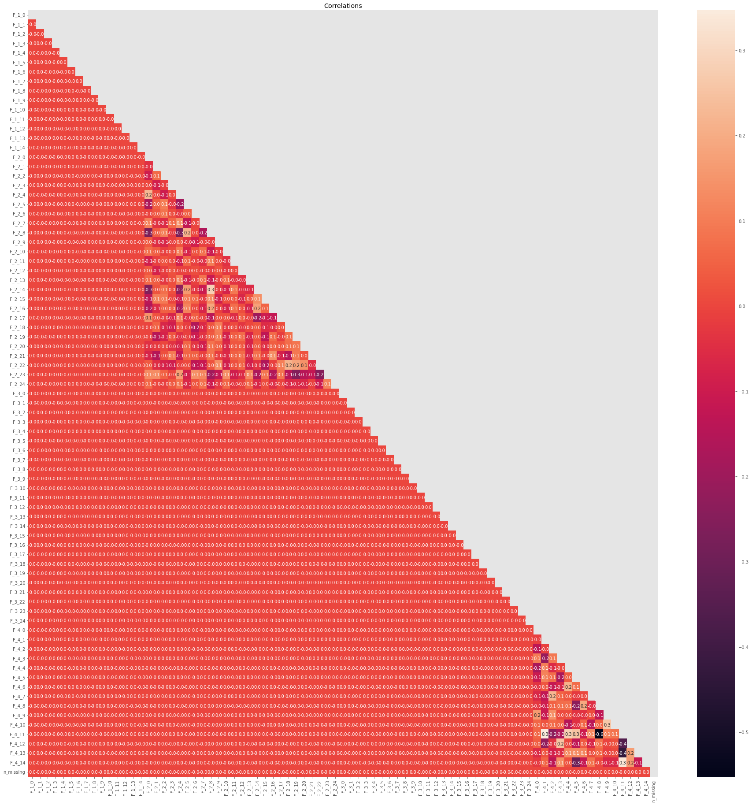
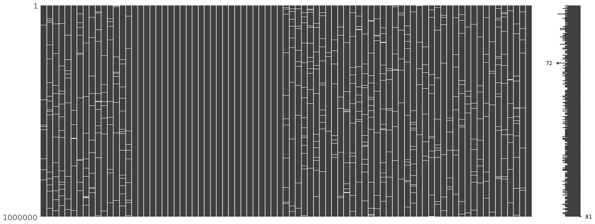
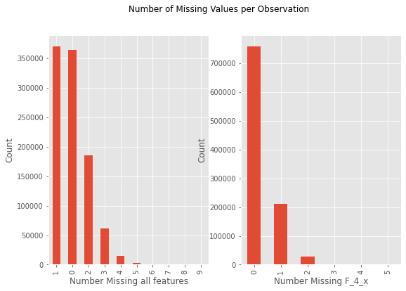

# Kaggle Tabular Playground Series - June 2022
## Missing Value Imputation

# **Table of Contents**

1. [Overview](https://github.com/Graham-Broughton/Kaggle/blob/master/Imputation_062022/readme.md#Overview)
2. [Exploratory Data Analysis](https://github.com/Graham-Broughton/Kaggle/blob/master/Imputation_062022/readme.md#Exploratory-Data-analysis)
3. [Baseline Modelling](https://github.com/Graham-Broughton/Kaggle/blob/master/Imputation_062022/readme.md#Baseline-Modelling)
4. [Multilayer Perceptron](https://github.com/Graham-Broughton/Kaggle/blob/master/Imputation_062022/readme.md#Multilayer-Perceptron)
5. [Conclusion](https://github.com/Graham-Broughton/Kaggle/blob/master/Imputation_062022/readme.md#Conclusion)

# **Overview**
Life is not always perfect, and neither is data. Often times, real world data has missing values which are present in various ways eg. they could be spread randomly or could be focused in one feature. How to handle these missing values is an important skill for a data scientist to have to make sure as much data is recovered as possible and the recovered data is as close to the original values as possible. [this Kaggle challenge](https://www.kaggle.com/competitions/tabular-playground-series-jun-2022/overview) uses a synthetic dataset that was setup to mimmic real world manufactoring data and is chocked full of missing values. A thorough Exploratory Data Analysis (EDA) enabled me to confidently impute with means where appropriate, which allowed me to focus my time on the feature group where using models was advantageous. My final model was a multi-head Multilayer Perceptron with skip connections and _mish_ activator. Using this model I obtained a root mean squared error of 0.85912 which put me in 112/847. This repository is organized into two directories: the 'Final' directory contains a notebook with the highlights of the EDA as well as the MLP along with supporting .py and .YAML files, you should be able to 'plug-and-play'. The other directory contains the majority of my previous work if your curious about my work flow, problem solving, etc.

# **Exploratory Data Analysis**
The dataset was 1 million observations of 81 features, split between 4 groups (F_1_x, F_2_x, F_3_x and F_4_x), three of which were continuous (float64) and held all 1 million missing values and the other was discrete (int64). Using pandas, I made a dataframe to show some basic info and found two of the continuous groups (F_1_x, F_3_x) had a mean/median and std of ~0 and ~1, respectively, indicating these features were standardized. The histograms provided evidence that the continuous features follow a normal-like distribution as well as showing skew/Poisson distribution in the discrete features. The correlation matrix (shown below) shows features within F_2_x and F_4_x have linear relationships with features from the same group with no other correlations. 

To confirm that the missing values were randomly distributed, I used missingno library's matrix plot shown here.Further analysis using missingno's dendrogram to compare features' nullity correlation showed all features are not correlated with missing values.

Looking at the number of missing values per observation we see that they are not even among groups. This could be due to the groups not containing the same number of features - more features, higher chance of the row containing a missing value.

     

Since the missing values are randomly distributed as well as groups F_1_x and F_3_x being independent, the imputation method that should give the best results is a simple imuptation using the mean. This is due to the fact that when you minimize the derivitive of RMSE it yields the mean. Here we must assume that the training/validation mean is the same, or at least very close, to the test mean.

# **Baseline Modelling**
I started by using a simple imputer to impute a few different values (constants, mean, median) in different combinations throughout the groups too see which was best and which groups/features seemed more responsive than others. As hypothesized, the mean was the best value to impute for F_1_x and F_3_x. Then, I began experimenting with sklearn's IterativeImputer, PyCaret and feature engineering. During the feature engineering, I introduced a large amount of data leakage which ruined any predictive power and interpretability of most of the models I was using... Another lesson learned in data leakage!

# **Multilayer Perceptron**
The first MLP I made had five hidden layers (1024, 512, 512, 128, 64 nodes), used 'swish' activator, Adam optimizer and learning rate reduced on plateau. It actually scored quite well, basically a draw between it and my final model. The problem with this model was that it was prohibitively long to train - there were 14 different models, one for each F_4 feature, and nearly 800 000 rows, times five for cross validation. I tried some time reducing techniques: creating tf.Datasets for use with a TPU, reducing hidden layers and reducing nodes. The tf.Datasets were a total failure and reducing the hidden layers and nodes damaged the score too much. This is were I settled on the multihead + skip connection approach, I also switched to AdamW which improved the score a bit. My first of this next gen model had three 'heads' and four repeating dense layer skip blocks. It drastically reduced training time but the error was still too high. I finally settled on this model which produced good results for much less time:

# **Conclusion**
I thought this was a really good competition because missing values are a real world problem, it really made you think about the EDA and I was gained valuable experience designing neural networks along with a plethora of other models. I entered this competition to gain experience in data science, it based on a very common real world problem enhanced the learning experience for me as I am now much for comfortable knowing what to do in this scenario. This competition was already very computationally demanding, if you went about it trying to use a neural network to impute all missing values you would not get very far. The EDA itself was fairly bare - it did not uncover some hidden 'trick' - which fortifies how important not just performing an EDA is, but to really try and understand what information it is showing you. I have quite an affinity for neural networks so I really enjoyed tinkering around and sucessfully implementing skip connections for my first time. If I had more time I would have liked to experiment with dropout layers and more/different normalization layers as well as splitting the test data based on missing value count per row. So, for missing value count one, it would be the same method I used here but for counts higher I would have as many targets as that iteration's missing value count.

Thanks for sticking around to the end!
